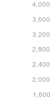

该程序为Chrome 插件。本插件使用方式2爬数据，所以请详细看方式2
### 难点
暂时没想到直接获取数据的方法，因为百度指数的数据是动态加密传输的，动态的验证数据也不是接口给的，与网页上里面脚本的动态字符串相关。非常复杂。总之一句话，我抓不到这个数据，模拟接口环境很难。真的很难拿到真实数据，如果有同学能拿到，疑问或交流QQ：798159421
### 爬取百度指数
真实的百度指数数据在后端，前端页面的获取数据有2种。真实与非真实
#### 方式1
真实数据（前端以图片形式动态获取图片并且拼接）。比如这里，真实数据2124，这里2124是动态获取，而且是图片拼的2124.，用啥图片拼的？没错，看的就让人崩溃，是用这个图片拼的2124。所以，基本上想要直接获取2124是不可能的。放弃。
#### 方式2
非真实数据（变换后的数据），以数字形式存在。百度指数前端展示是一条曲线。既然能画出曲线，那前端必然拿到了数据，但是它是变换后的数据。有兴趣可以看看百度指数页面里面的getAllIndex和getSubIndex接口，里面的msg就是返回的数据，其中msg.data.all[0].userIndexs_100返回的数据是经过线性变换的数据,而且变换数据压缩在100以内。这里还需要用到一个图片
比如真实数据为3000，那么3000对应在msg里面的值可能是65（差不多这么多,接下来会算），看这个纵坐标图片，步长为400，实际最小值为1600-400=1200（不是1600）. 这里的意思就是如果我要把3000画在前端，那么它的“高度”的公式就是  (3000-1200)/((4000-1200)/99) = 63.6 但是前端只会给你整数，可能是64，或者63.反正会有点误差。公式 real = (top-bottom) * (data/99) + bottom
* 所以重点来了。我们就只需要2样东西，一个是变换的scale，是一张图片，识图得到top和bottom.（(上图，bottom是1600-400=1200)！！！！牢记)。另外一个是接口变化后的range 100的数据 data100。 公式 realData = (top - bottom) * (data100/99) + bottom

## 插件做什么
这个插件就只是帮助下载一个百度指数关键字的 __所有年份__ 的数据，和图片。大胸弟，轮子已经帮你造好了！在chrome里安装插件，打开百度指数的页面，就能下载数据和图片。

## 打开百度指数的页面，就能下载数据和图片

未完待续...